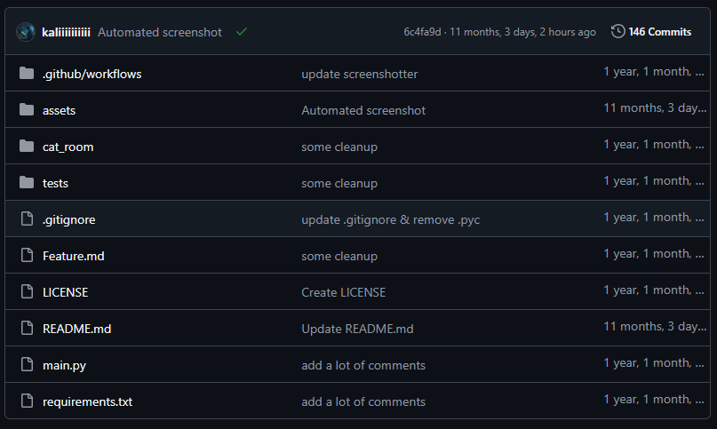
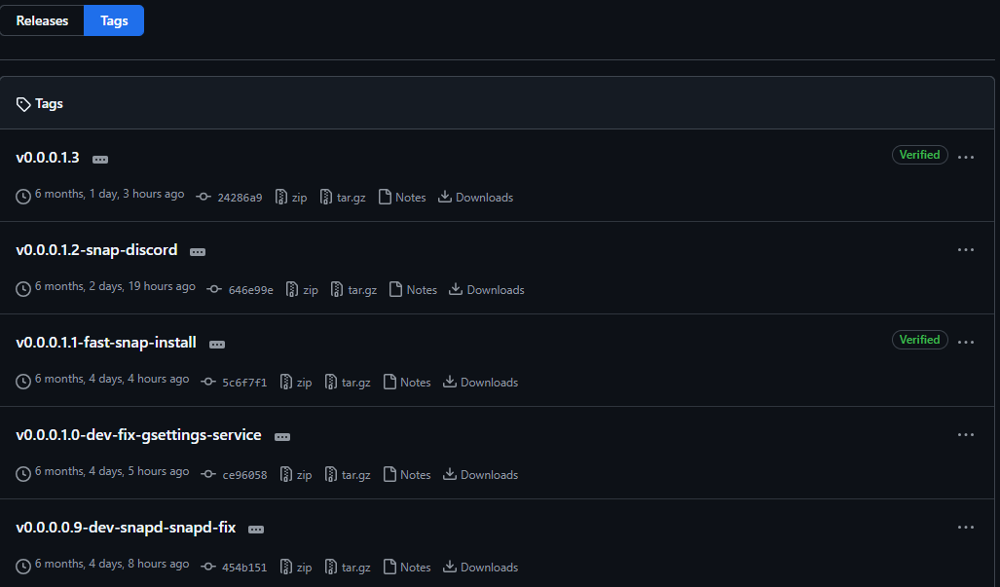

# Installation
Install from [Chrome Web Store]() (Not yet published -> TODO)

## Result

Releases

File browser

Tags

## References
- The [original extension](https://github.com/jan0991/github-actions-full-datetime)
- The [improved extension](https://github.com/jan0991/github-actions-full-datetime)
