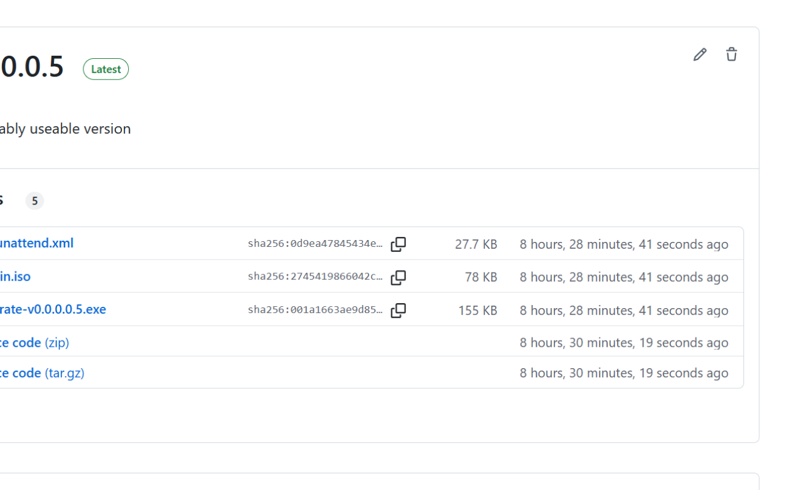

# Why?

See Github community discussion: https://github.com/orgs/community/discussions/58663

# Installation
Install from [Chrome Web Store](https://chromewebstore.google.com/detail/github-accurate-time-disp/fhoalenimobepcaddmalfppleofpkill)

## Result

File browser
<picture>
  <source 
    srcset="https://raw.githubusercontent.com/kaliiiiiiiiii/github-accurate-timedelta/refs/heads/main/static/screenshot_release_dark.png" 
    media="(prefers-color-scheme: dark)" />
  
</picture>

Main view
<picture>
  <source 
    srcset="https://raw.githubusercontent.com/kaliiiiiiiiii/github-accurate-timedelta/refs/heads/main/static/screenshot_main_dark.png" 
    media="(prefers-color-scheme: dark)" />
  
</picture>

Tags
<picture>
  <source 
    srcset="https://raw.githubusercontent.com/kaliiiiiiiiii/github-accurate-timedelta/refs/heads/main/static/screenshot_tags_dark.png" 
    media="(prefers-color-scheme: dark)" />
  
</picture>

## References
- The [original extension](https://github.com/jan0991/github-actions-full-datetime)
- The [improved extension](https://github.com/jan0991/github-actions-full-datetime)
